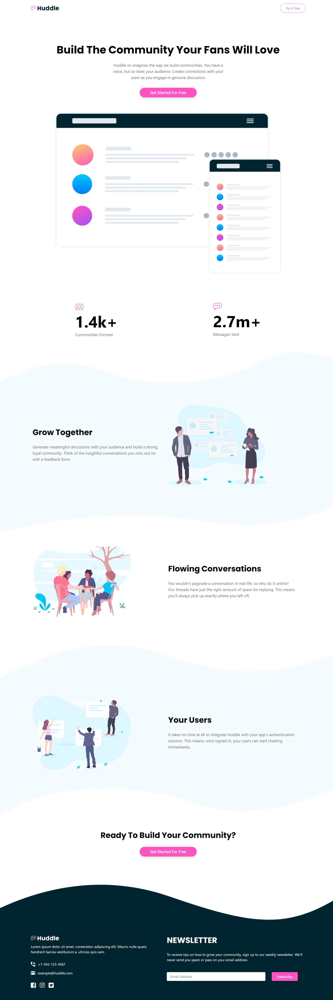

# Frontend Mentor - Huddle Landing Page with Curved Sections Solution

This is my solution to the [Huddle landing page with curved sections challenge on Frontend Mentor](https://www.frontendmentor.io/challenges/huddle-landing-page-with-curved-sections-5ca5ecd01e82137ec91a50f2). This project helped me refine my layout skills using modern CSS and strengthen my responsive design approach.

## Table of Contents

- [Frontend Mentor - Huddle Landing Page with Curved Sections Solution](#frontend-mentor---huddle-landing-page-with-curved-sections-solution)
  - [Table of Contents](#table-of-contents)
  - [Overview](#overview)
    - [The Challenge](#the-challenge)
    - [Screenshot](#screenshot)
    - [Links](#links)
  - [My Process](#my-process)
    - [Built With](#built-with)
    - [What I Learned](#what-i-learned)
    - [Continued Development](#continued-development)
    - [Useful Resources](#useful-resources)
  - [Author](#author)

## Overview

### The Challenge

Users should be able to:

- View the optimal layout depending on the screen size
- See hover states for all interactive elements

### Screenshot



### Links

- Solution URL: [View my solution on Frontend Mentor](https://www.frontendmentor.io/solutions/huddle-landing-page-with-curved-sections---tailwindcss-oE_DkitQRR)
- Live Site URL: [Live preview](https://fawaziwalewa.github.io/huddle-landing-page-with-curved-sections-solution/)

## My Process

### Built With

- Semantic HTML5 markup
- TailwindCSS
- Flexbox
- Mobile-first workflow
- Responsive design techniques

### What I Learned

This project helped me get more confident using TailwindCSS to handle responsive flexbox layouts and spacing. One specific improvement I made was refactoring static sections into responsive flex containers that adapt based on screen size:

```html
<div class="flex flex-col items-center justify-between gap-16 md:flex-row-reverse md:gap-0">
  <!-- Image -->
  
  
  <!-- Text Content -->
  <div class="text-center md:text-left">
    <h2 class="text-2xl font-bold md:text-4xl">...</h2>
    <p class="mt-6 text-gray-500 md:mt-8 md:text-lg">...</p>
  </div>
</div>
```

### Continued Development

Next, I want to explore:

- Using more accessibility best practices in my layout and structure

### Useful Resources

- [TailwindCSS Documentation](https://tailwindcss.com/docs) – My go-to for styling
- [Frontend Mentor Slack Community](https://frontendmentor.io/slack) – Always good for feedback and support

## Author

- Website – [iwaola.me](https://iwaola.me)
- Frontend Mentor – [@fawaziwalewa](https://www.frontendmentor.io/profile/fawaziwalewa)
- Twitter – [@IwalewaFawaz](https://twitter.com/IwalewaFawaz)
- LinkedIn – [Fawaz Iwalewa](https://www.linkedin.com/in/fawaz-iwalewa/)
